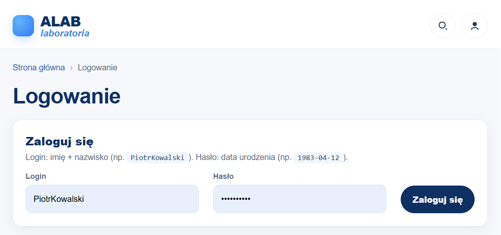
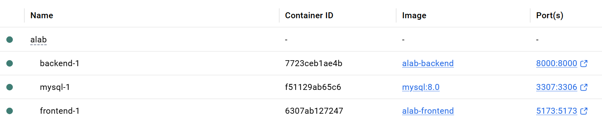
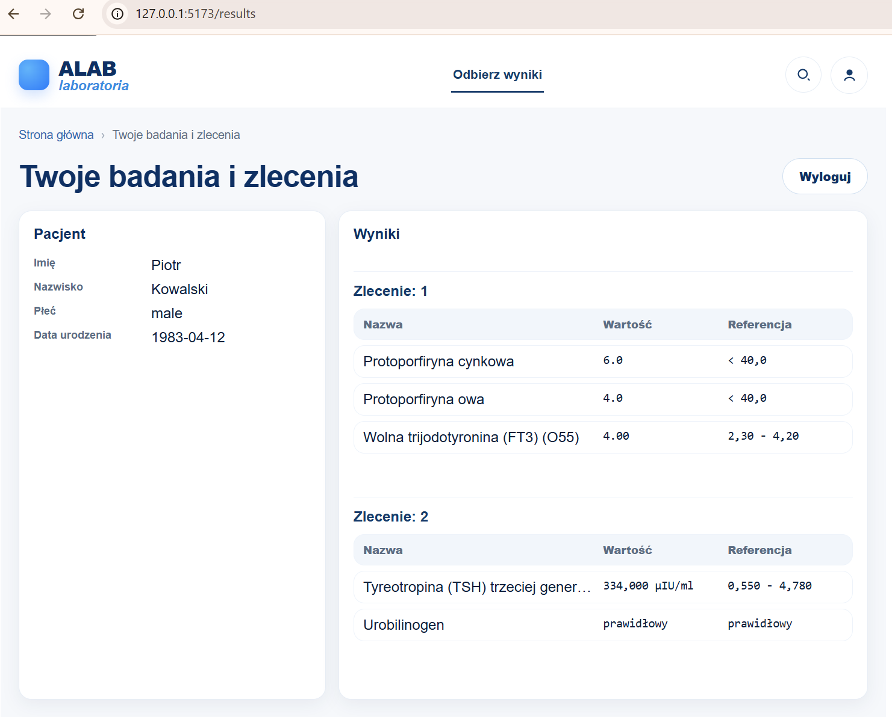
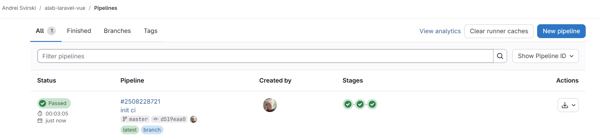

<p align="center">
  
</p>

# ALAB (Laravel + Vue) — uruchomienie i CI/CD

Repozytorium zawiera:

- `backend/`: API w Laravel (logowanie JWT + wyniki badań)
- `frontend/`: aplikacja Vue (logowanie + podgląd wyników)
- `docker-compose.yml`: lokalne uruchomienie (MySQL + backend + frontend)
- `.gitlab-ci.yml`: pipeline GitLab CI/CD (testy, build frontu, build+push obrazów)

## Wymagania

#### Lokalnie (bez Dockera)

- PHP (zgodny z `backend/composer.json`)
- Composer
- Node.js + npm
- MySQL 8 (lub zgodnie z konfiguracją)

#### Lokalnie (z Dockerem) — rekomendowane

- Docker + Docker Compose

<p align="center">
  
</p>

## Uruchomienie lokalne przez Docker Compose (rekomendowane)

1. Uruchom kontenery:

```bash
docker compose up --build
```

2. Adresy:

- Backend (Laravel): `http://localhost:8000`
- Frontend (Vite): `http://localhost:5173`
- MySQL na hoście: `127.0.0.1:3307` (port 3307, żeby nie kolidować z lokalnym MySQL na 3306)

3. Import danych CSV:

- Domyślna ścieżka importu w komendzie: `import/results.csv` (w kontenerze: `/var/www/html/import/results.csv`)
- `docker-compose.yml` próbuje wykonać import automatycznie przy starcie backendu, jeśli plik istnieje.

Ręczne uruchomienie importu:

```bash
docker compose exec backend php artisan app:import-results-csv /var/www/html/import/results.csv
```

<p align="center">
  
</p>


## Uruchomienie lokalne bez Dockera

#### Backend (Laravel)

1. Instalacja zależności:

```bash
cd backend
composer install
```

2. Konfiguracja `.env`:

- Skopiuj `backend/.env.example` do `backend/.env`
- Ustaw połączenie do bazy (`DB_*`)

3. Klucz aplikacji + migracje:

```bash
php artisan key:generate
php artisan migrate
```

4. Start serwera:

```bash
php artisan serve
```

5. Import danych CSV:

```bash
php artisan app:import-results-csv import/results.csv
```

Log importu trafia do: `backend/storage/logs/import-results.log`.


#### Frontend (Vue)

```bash
cd frontend
npm install
npm run dev
```

Build produkcyjny:

```bash
npm run build
```

<p align="center">
  
</p>


## Testy

#### Backend (PHPUnit)

```bash
cd backend
php artisan test
```

Uwaga: testy feature importują dane z **repozytoryjnego** pliku fixture:

- `backend/tests/Fixtures/results.csv`

To celowe — katalog `backend/import/` jest ignorowany przez GIT (lokalny plik roboczy), więc pipeline CI nie może na nim polegać.

## API

- `POST /api/login`
  - `login`: np. `PiotrKowalski`
  - `password`: data urodzenia, np. `1983-04-12`
  - zwraca token JWT
- `GET /api/results`
  - nagłówek: `Authorization: Bearer <token>`

## CI/CD (GitLab)

Konfiguracja pipeline znajduje się w `.gitlab-ci.yml` i składa się z etapów:

- `test`: uruchamia testy backendu (PHPUnit) na MySQL w serwisie
- `build`: buduje frontend
- `docker`: buduje i wypycha obrazy Dockera (backend + frontend) do GitLab Container Registry

#### Job: `backend:tests`

- **Image**: `php:8.4-cli`
- **Service**: `mysql:8.0` (alias `mysql`)
- **Kroki**:
  - instaluje paczki systemowe + rozszerzenia PHP (`pdo_mysql`, `zip`)
  - tworzy `backend/.env.ci` z konfiguracją pod CI (MySQL, cache/queue/session w trybie in-memory)
  - `composer install`
  - `php artisan key:generate`
  - `php artisan migrate --force`
  - `php artisan test --ansi`
- **Artefakty** (zawsze): `backend/storage/logs/` (pomocne przy debugowaniu)

#### Job: `frontend:build`

- **Image**: `node:20-alpine`
- **Kroki**:
  - `npm ci`
  - `npm run build`
- **Artefakty**: `frontend/dist/`

#### Job: `docker:build_and_push`

- **Image**: `docker:27` + `docker:27-dind`
- **Wymaga**:
  - poprawnie skonfigurowanego GitLab Container Registry dla projektu
  - zmiennych `CI_REGISTRY_USER`, `CI_REGISTRY_PASSWORD`, `CI_REGISTRY` (GitLab dostarcza je automatycznie)
- **Wynik**:
  - obrazy:
    - `$CI_REGISTRY_IMAGE/backend:$CI_COMMIT_SHA` i `:latest`
    - `$CI_REGISTRY_IMAGE/frontend:$CI_COMMIT_SHA` i `:latest`

---

<p align="center">
  
</p>


## Linki

- GitHub: [clastr33/alab-laravel-vue](https://github.com/clastr33/alab-laravel-vue)
- GitLab: [clastr/alab-laravel-vue](https://gitlab.com/clastr/alab-laravel-vue)


#### Update GitLab
```bash
cd ../alabgitlab-http
git remote add github https://github.com/clastr33/alab-laravel-vue.git
git fetch github --prune
git merge github/master --allow-unrelated-histories
git push
```
